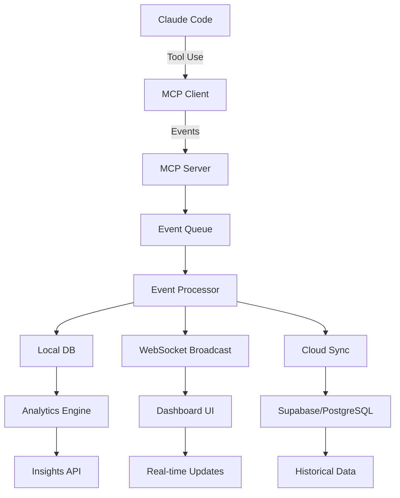

# Frizy MCP Server Architecture

## Overview
A Model Context Protocol (MCP) server that captures, stores, and serves AI assistant interaction data with real-time synchronization and intelligent context management.

## Core Components

### 1. Data Capture Layer
- **File System Watcher**: Monitor code changes in real-time
- **Git Integration**: Track commits, branches, PRs
- **Tool Usage Tracker**: Log all Claude tool interactions
- **Context Analyzer**: Calculate token usage and context windows

### 2. Processing Pipeline
```
Event → Validation → Enrichment → Storage → Broadcast
```

### 3. Storage Architecture

#### Local Storage (SQLite/DuckDB)
```sql
-- Core tables for fast local access
CREATE TABLE sessions (
    id TEXT PRIMARY KEY,
    started_at TIMESTAMP,
    ended_at TIMESTAMP,
    context_usage INTEGER,
    status TEXT
);

CREATE TABLE events (
    id TEXT PRIMARY KEY,
    session_id TEXT,
    timestamp TIMESTAMP,
    type TEXT,
    tool TEXT,
    data JSONB,
    impact TEXT
);

-- Materialized views for analytics
CREATE VIEW session_analytics AS
SELECT
    DATE(started_at) as day,
    COUNT(*) as session_count,
    AVG(context_usage) as avg_context,
    SUM(json_array_length(data->>'files_modified')) as files_changed
FROM sessions
GROUP BY DATE(started_at);
```

#### Cloud Sync (Optional)
- Periodic sync to Supabase/PostgreSQL
- Conflict resolution with last-write-wins
- Compressed event batching

### 4. Real-time Communication

#### WebSocket Server
```javascript
// Real-time event streaming
class MCPWebSocketServer {
    constructor() {
        this.wss = new WebSocketServer({ port: 3333 });
        this.clients = new Map();
    }

    broadcast(event) {
        const message = JSON.stringify({
            type: 'event',
            timestamp: new Date().toISOString(),
            data: event
        });

        this.clients.forEach(client => {
            if (client.readyState === WebSocket.OPEN) {
                client.send(message);
            }
        });
    }

    handleConnection(ws) {
        const clientId = generateId();
        this.clients.set(clientId, ws);

        ws.on('message', (data) => {
            this.handleMessage(clientId, JSON.parse(data));
        });

        ws.on('close', () => {
            this.clients.delete(clientId);
        });
    }
}
```

### 5. API Endpoints

```typescript
// RESTful API design
interface MCPServerAPI {
    // Session Management
    POST   /api/sessions/start
    GET    /api/sessions/current
    POST   /api/sessions/{id}/end
    GET    /api/sessions/history

    // Event Streaming
    POST   /api/events
    GET    /api/events/stream (SSE)
    WS     /api/events/ws (WebSocket)

    // Context Management
    GET    /api/context/usage
    POST   /api/context/checkpoint
    GET    /api/context/suggestions

    // Analytics
    GET    /api/analytics/dashboard
    GET    /api/analytics/patterns
    GET    /api/analytics/insights

    // File System
    GET    /api/files/changes
    POST   /api/files/watch
    GET    /api/files/history

    // Git Integration
    GET    /api/git/status
    GET    /api/git/commits
    POST   /api/git/hooks
}
```

## Data Flow Architecture



## Best Practices for User Experience

### 1. Performance Optimization
- **Event Batching**: Group events in 100ms windows
- **Compression**: Use MessagePack for binary serialization
- **Indexing**: Create indexes on timestamp, session_id, tool
- **Caching**: Redis/Memory cache for hot data

### 2. Data Privacy & Security
- **Local-First**: All data stored locally by default
- **Encryption**: AES-256 for sensitive data
- **Selective Sync**: User chooses what to sync
- **Data Retention**: Configurable auto-cleanup

### 3. Smart Context Management
```javascript
class ContextManager {
    constructor() {
        this.maxTokens = 200000; // Claude's context limit
        this.buffer = 0.9; // Use 90% to leave room
    }

    async optimizeContext(session) {
        const usage = await this.calculateUsage(session);

        if (usage > this.maxTokens * this.buffer) {
            return {
                action: 'compress',
                suggestions: [
                    'Summarize older blocks',
                    'Archive completed tasks',
                    'Start new session'
                ]
            };
        }

        return { action: 'continue', usage, remaining: this.maxTokens - usage };
    }

    async intelligentSummarization(blocks) {
        // Use embeddings to identify important context
        const embeddings = await this.generateEmbeddings(blocks);
        const clusters = this.clusterBySemanticSimilarity(embeddings);

        return clusters.map(cluster => ({
            summary: this.summarizeCluster(cluster),
            importance: this.calculateImportance(cluster),
            tokens: this.countTokens(cluster)
        }));
    }
}
```

### 4. Intelligent Features

#### Pattern Recognition
```javascript
class PatternAnalyzer {
    async detectPatterns(events) {
        return {
            frequentTools: this.findFrequentTools(events),
            workflowPatterns: this.detectWorkflows(events),
            errorPatterns: this.findErrorPatterns(events),
            timePatterns: this.analyzeTimeDistribution(events)
        };
    }

    suggestOptimizations(patterns) {
        const suggestions = [];

        if (patterns.frequentTools.includes('file_search') > 10) {
            suggestions.push({
                type: 'optimization',
                message: 'Consider indexing your codebase for faster searches',
                action: 'setup_index'
            });
        }

        return suggestions;
    }
}
```

#### Predictive Context Loading
```javascript
class PredictiveLoader {
    async preloadContext(currentActivity) {
        // Based on current activity, predict what context will be needed
        const predictions = await this.mlModel.predict(currentActivity);

        return {
            likelyFiles: predictions.files,
            likelyTools: predictions.tools,
            relatedSessions: predictions.sessions
        };
    }
}
```

## Implementation Priority

### Phase 1: Core Foundation (Week 1)
1. ✅ Basic WebSocket server
2. ✅ SQLite database setup
3. ✅ Event capture system
4. ✅ Basic API endpoints

### Phase 2: Real-time Features (Week 2)
1. WebSocket broadcasting
2. Live dashboard updates
3. Session management
4. Context tracking

### Phase 3: Intelligence Layer (Week 3)
1. Pattern detection
2. Smart summarization
3. Predictive loading
4. Analytics engine

### Phase 4: Advanced Features (Week 4)
1. Git integration
2. File system watching
3. Cloud sync
4. Export/Import

## Technology Stack Recommendation

### For Best Performance + UX:
```json
{
  "server": "Node.js + Fastify",
  "database": "SQLite (local) + DuckDB (analytics)",
  "realtime": "WebSocket + Server-Sent Events",
  "queue": "BullMQ with Redis",
  "cache": "Node-Cache (memory)",
  "monitoring": "Pino logger + Prometheus metrics",
  "testing": "Vitest + Playwright"
}
```

### Alternative High-Performance Stack:
```json
{
  "server": "Bun/Deno",
  "database": "RocksDB + Parquet files",
  "realtime": "gRPC streaming",
  "queue": "NATS JetStream",
  "cache": "Built-in memory",
  "monitoring": "OpenTelemetry",
  "testing": "Native test runners"
}
```

## Security Considerations

1. **Authentication**: JWT tokens with refresh rotation
2. **Authorization**: Role-based access control
3. **Encryption**: TLS for transport, AES for storage
4. **Audit Log**: Track all data access
5. **Rate Limiting**: Prevent abuse
6. **Input Validation**: Sanitize all inputs

## Monitoring & Observability

```javascript
class MCPMonitor {
    metrics = {
        eventsPerSecond: new prometheus.Gauge(),
        contextUsage: new prometheus.Histogram(),
        sessionDuration: new prometheus.Histogram(),
        errorRate: new prometheus.Counter()
    };

    trackEvent(event) {
        this.metrics.eventsPerSecond.inc();

        if (event.type === 'error') {
            this.metrics.errorRate.inc();
        }
    }

    healthCheck() {
        return {
            status: 'healthy',
            uptime: process.uptime(),
            memory: process.memoryUsage(),
            connections: this.activeConnections.size,
            eventRate: this.metrics.eventsPerSecond.get()
        };
    }
}
```

## Deployment Options

### Local Development
```bash
npm run dev:mcp-server
```

### Production - Self-Hosted
```dockerfile
FROM node:20-alpine
WORKDIR /app
COPY . .
RUN npm ci --production
EXPOSE 3333
CMD ["node", "mcp-server.js"]
```

### Production - Cloud
- **Fly.io**: Global edge deployment
- **Railway**: One-click deploy
- **Render**: Auto-scaling
- **Cloudflare Workers**: Serverless option

## Next Steps

1. Choose architecture based on requirements
2. Set up development environment
3. Implement core WebSocket server
4. Add SQLite database layer
5. Build event capture system
6. Create dashboard integration
7. Add intelligent features
8. Deploy and test