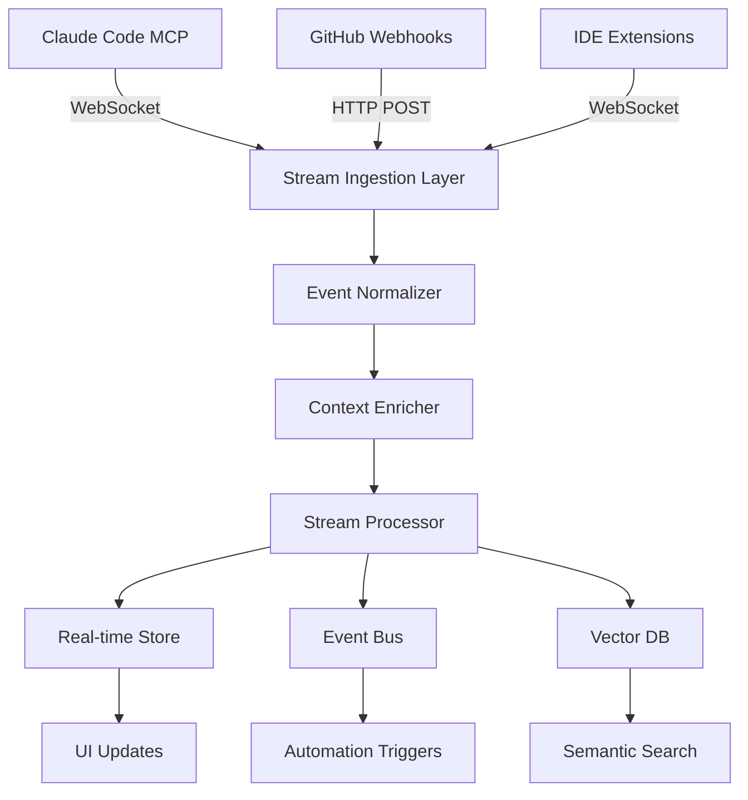

# Frizy.ai MCP & GitHub Integration Architecture

## Data Streams Overview

### 1. Claude Code MCP Streams (Incoming)

#### Tool Execution Events
```typescript
interface MCPToolEvent {
  id: string;
  timestamp: string;
  tool: 'Read' | 'Write' | 'Edit' | 'Bash' | 'Search' | 'WebFetch';
  parameters: Record<string, any>;
  result: {
    success: boolean;
    output?: string;
    error?: string;
    tokens: number;
  };
  context: {
    conversationId: string;
    messageId: string;
    projectPath: string;
  };
}
```

#### Conversation Context
```typescript
interface MCPConversationEvent {
  id: string;
  timestamp: string;
  type: 'user_message' | 'assistant_response' | 'system_message';
  content: string;
  metadata: {
    model: string;
    tokens: { input: number; output: number };
    latency: number;
    reasoning?: string[];
  };
}
```

#### Decision Points
```typescript
interface MCPDecisionEvent {
  id: string;
  timestamp: string;
  decision: {
    type: 'architecture' | 'implementation' | 'refactor' | 'debug';
    options: string[];
    selected: string;
    rationale: string;
  };
  affectedFiles: string[];
  impact: 'low' | 'medium' | 'high';
}
```

### 2. GitHub Event Streams (Incoming)

#### Code Changes
```typescript
interface GitHubCodeEvent {
  id: string;
  timestamp: string;
  type: 'commit' | 'push' | 'pull_request';
  repository: string;
  branch: string;
  author: string;
  changes: {
    files: Array<{
      path: string;
      additions: number;
      deletions: number;
      patch: string;
    }>;
    summary: string;
  };
}
```

#### Issue & PR Context
```typescript
interface GitHubWorkflowEvent {
  id: string;
  timestamp: string;
  type: 'issue_created' | 'issue_comment' | 'pr_review' | 'pr_merged';
  metadata: {
    number: number;
    title: string;
    body: string;
    labels: string[];
    assignees: string[];
  };
  linkedConversations: string[]; // Links to Claude conversations
}
```

### 3. IDE Events (VSCode/Cursor)
```typescript
interface IDEEvent {
  id: string;
  timestamp: string;
  type: 'file_open' | 'file_save' | 'debug_session' | 'test_run';
  file?: string;
  diagnostics?: Array<{
    severity: 'error' | 'warning' | 'info';
    message: string;
    line: number;
    column: number;
  }>;
  testResults?: {
    passed: number;
    failed: number;
    duration: number;
  };
}
```

## Stream Processing Pipeline



## Data We Want to Capture

### Critical Context Points
1. **Decision Rationale** - Why Claude chose approach A over B
2. **Problem-Solution Pairs** - Issues encountered and how they were resolved
3. **Code Evolution** - How implementations changed over iterations
4. **Dependencies** - What relies on what, discovered through usage
5. **Performance Insights** - Bottlenecks found and optimizations made
6. **Failed Attempts** - What didn't work and why (invaluable context)

### Metadata to Track
- Token usage per operation
- Time spent per task
- Error frequency and types
- Refactor patterns
- Test coverage changes
- Documentation updates

## Implementation Architecture

### Core Components

1. **MCP Server Adapter**
   - WebSocket connection to Claude Code
   - Event filtering and routing
   - Backpressure handling

2. **GitHub Integration Service**
   - Webhook receiver
   - GraphQL API client for enrichment
   - Event correlation engine

3. **Stream Processing Engine**
   - Apache Kafka or Redis Streams for event bus
   - Stream aggregation windows
   - Pattern detection algorithms

4. **Context Storage Layer**
   - PostgreSQL for structured data
   - pgvector for embeddings
   - Redis for real-time cache
   - S3 for code snapshots

5. **Intelligence Layer**
   - Context ranking algorithm
   - Relevance scoring
   - Auto-summarization
   - Pattern recognition

## Real-time Data Flow

```typescript
// Example stream handler
class MCPStreamHandler {
  private eventBus: EventBus;
  private contextStore: ContextStore;
  
  async handleToolEvent(event: MCPToolEvent) {
    // Normalize event
    const normalized = this.normalizeEvent(event);
    
    // Enrich with context
    const enriched = await this.enrichContext(normalized);
    
    // Determine container placement
    const container = this.findOrCreateContainer(enriched);
    
    // Create context block
    const contextBlock = {
      id: generateId(),
      type: this.determineBlockType(event.tool),
      container: container.id,
      trace: this.createTrace(event),
      timestamp: event.timestamp,
      importance: this.calculateImportance(enriched),
      connections: this.findConnections(enriched)
    };
    
    // Store and broadcast
    await this.contextStore.save(contextBlock);
    this.eventBus.emit('context.created', contextBlock);
    
    // Update UI in real-time
    this.broadcastToUI(contextBlock);
  }
  
  private determineBlockType(tool: string): 'memory' | 'action' | 'decision' {
    const mapping = {
      'Read': 'memory',
      'Write': 'action',
      'Edit': 'action',
      'Bash': 'action',
      'Search': 'memory',
      'WebFetch': 'memory'
    };
    return mapping[tool] || 'action';
  }
}
```

## Expected Data Volumes

- **Tool Events**: 50-200 per session
- **Conversation Messages**: 20-50 per session  
- **GitHub Events**: 10-30 per day
- **IDE Events**: 100-500 per session

## Privacy & Security

- All data encrypted in transit (TLS 1.3)
- Sensitive data scrubbing before storage
- User-controlled data retention policies
- Option to exclude specific files/patterns
- Local-first with optional cloud sync

## Integration Points

### MCP Server Configuration
```json
{
  "mcpServers": {
    "frizy-context": {
      "command": "node",
      "args": ["./mcp-server/index.js"],
      "env": {
        "FRIZY_API_KEY": "${FRIZY_API_KEY}",
        "FRIZY_PROJECT_ID": "${FRIZY_PROJECT_ID}"
      }
    }
  }
}
```

### GitHub App Manifest
```yaml
name: Frizy Context Tracker
description: Captures development context for AI assistance
permissions:
  contents: read
  issues: write
  pull_requests: write
  actions: read
events:
  - push
  - pull_request
  - issues
  - issue_comment
  - pull_request_review
webhook_url: https://api.frizy.ai/webhooks/github
```

## Next Steps

1. Build MCP server implementation
2. Create GitHub App
3. Develop stream processing pipeline
4. Implement real-time UI updates
5. Add pattern detection algorithms